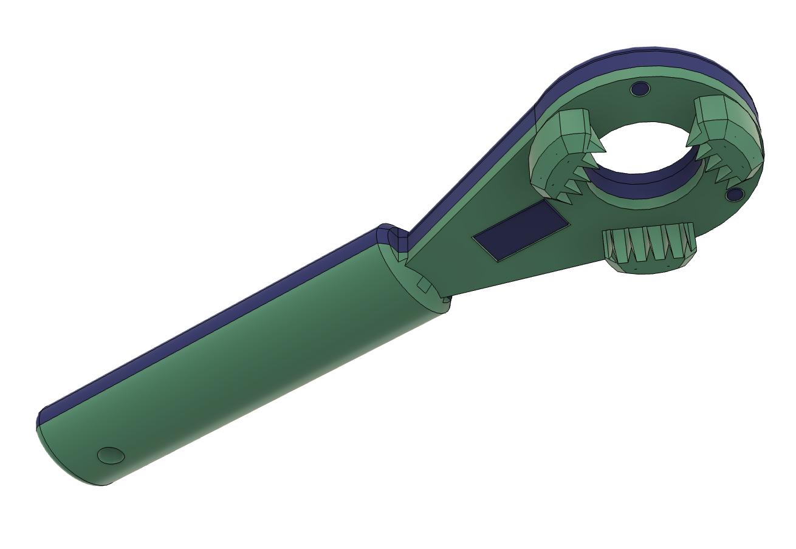
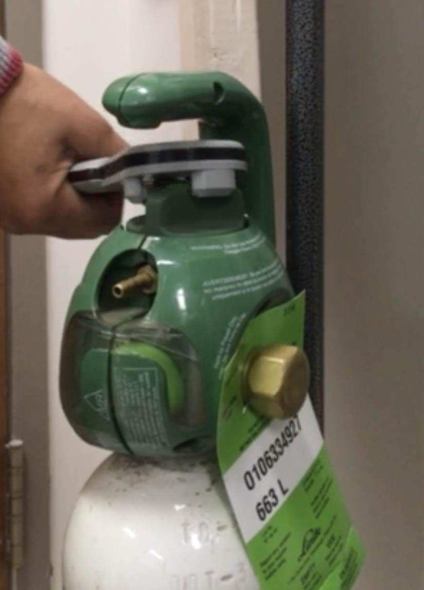
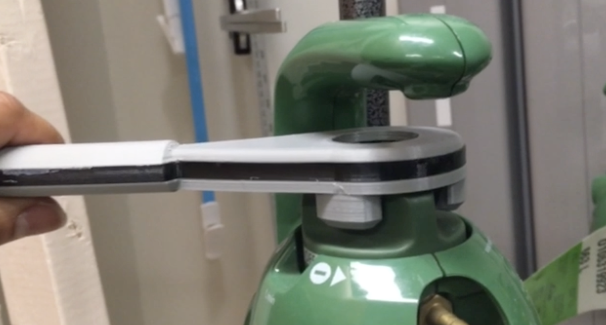

# O2TankHandle
3D printed assistive device to help open and close Praxair Grab'n Go® tanks with triangle shaped knob.

This handle has been designed to help patients with limited hand mobility to control by themselve oxygen flow during oxygen therapy.  It can be printed using common 3d printers. The inside of the handle can be made with PLA or PETG filament and the outside with TPU.

## Materials
1. TPU hardness 90A for the outside.  I have used [Polyflex TPU90](https://polymaker.com/product/polyflex-tpu90/).
2. PLA or PETG filament.
3. Glue: [E6000](https://eclecticproducts.com/product/e6000-industrial-adhesive/) which can be found at Canadian Tire or [Amazon](https://www.amazon.ca/Eclectic-EU10570110-Multi-purpose-Waterproof-Paintable/dp/B07MWH2Q4Z/ref=sr_1_5?dib=eyJ2IjoiMSJ9.aAfEi18wPfPPA_T1W8HiuTdHqN07RUhsRiUlvNAYgncpHXs6zlXjQPJB76fmRrpjLHt5T0j9_xNX5GLTLgnnNgu4p62iIZ0bjuie_AqLtjycfxm4bnsWxuTGKqfk1UQ9qNO1uksSuBphQ_2TcQtQCUPy-rhSWuJQ-iqRBBgHoyJiuwzNYulU4BJ4KU7BRanTDvfaqPULCGOLLYkvruxnOfoAFUv7JZObp_g9llKb54IwMMt21K42alQ_Mwp69ZLF6PIo8fu0rpLQYTDeg3BYPyf2JKEUebpyaNZZh5FRvTg.SAH2V6eWeXhl_FEsRLjoJSgqIzV1tD4AKo_M-27nl3U&dib_tag=se&hvadid=667162311008&hvdev=c&hvlocphy=9061029&hvnetw=g&hvqmt=e&hvrand=8512622173798829721&hvtargid=kwd-364888053517&hydadcr=20569_13479352&keywords=e6000+glue&qid=1712170475&sr=8-5).

## Build instructions
1. Print the center part [center.stl](variants/3parts/center.stl) using PLA or PETG. No support needed.
2. Print the [top.stl](variants/3parts/top.stl)  and [bottom.stl](variants/3parts/bottom.stl) with TPU. No support needed.
3. Glue the parts together using strong glue.

Note: if you are using the prusaSlicer, you can use the 3mf project files instead of the stl files.

## Special thanks
- Laura Tinmouth for the original idea and the tests at the Mount Sinai Hospital
- Claire Gane for the tests and feedbacks at the Jewish Rehabilitation Hospital
- [Lespacemaker](https://www.lespacemaker.com/en) for the 3d printers

