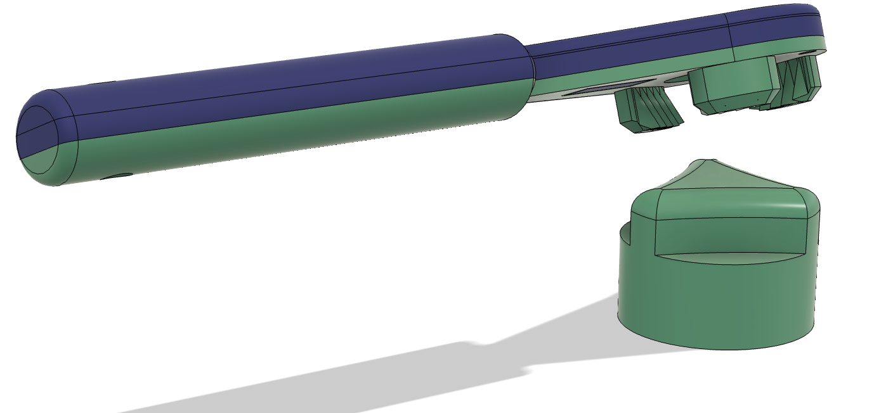

# O2TankHandle
3D printed assistive device to help turn an oxygen tank knob.

- Center part is printed in PLA or PETG.
- Top and bottom part are printed in TPU.
- All three parts are glued using E6000.

